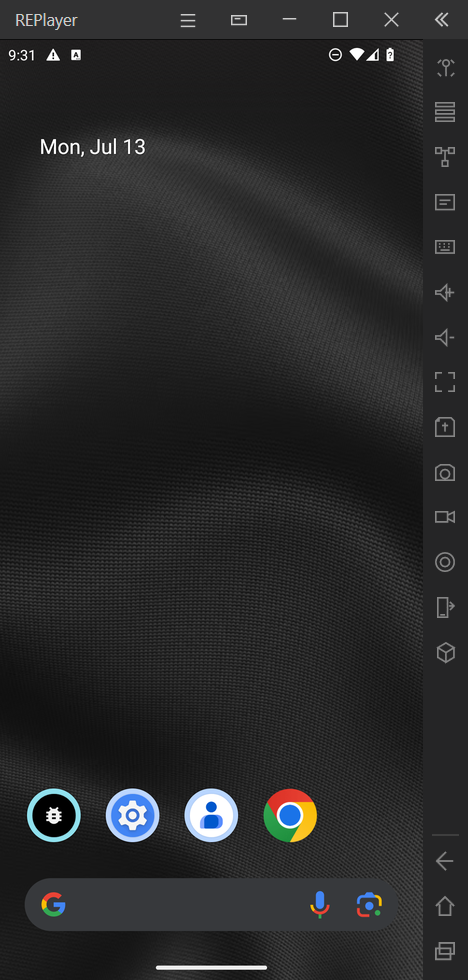
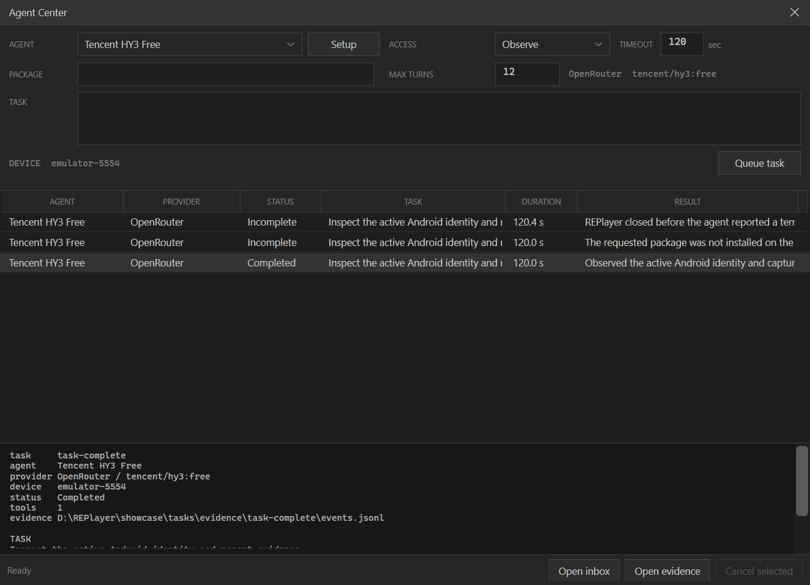

<div align="center">
  <h1>REPlayer</h1>
  <p><strong>ANDROID EMULATOR · AGENTIC AUTOMATION</strong></p>
  <p>A Windows-native Android 14 emulator for app automation, testing, instrumentation, and APK analysis.</p>

  <p>
    <a href="https://github.com/notgate/REPlayer/actions/workflows/build.yml"></a>
    
    
    
    
    <a href="../LICENSE"></a>
  </p>
</div>

---

## What it is

REPlayer is a native Windows Android emulator and automation platform. It is an open-source alternative to closed-source emulators such as BlueStacks, LDPlayer, and Nox, with transparent Android emulation and agentic automation as its focus.
Its Android 14 persona is **fingerprint-hardened**: REPlayer applies numerous framework, property, graphics, Settings, and identity patches so the guest does not present the usual stock-emulator defaults. Reverse engineering is one use case; repeatable Android automation, app testing, and agent-controlled device workflows are first-class uses as well.

## Preview

<div align="center">
  
  <p><sub>Native REPlayer chrome with the embedded Android 14 guest.</sub></p>

  
  <p><sub>Provider-backed agents, queued tasks, controlled device access, and evidence.</sub></p>
</div>

## Highlights

| | |
|---|---|
| **Android emulator** | Official Android Emulator with WHPX acceleration and a native embedded display. |
| **Agentic automation** | Concurrent provider-backed agents; parallel observation and serialized same-device control. |
| **Hardened persona** | Neutral REPlayer identity with patched framework, properties, graphics, Settings, and dark defaults. |
| **App tooling** | APK workflows, ADB, Frida integration, network capture, rotation, GPS, and device controls. |
| **Evidence** | Case-scoped logs, command results, captures, and JSONL agent history. |

## Quick start

A complete Windows distribution requires 64-bit Windows 11, hardware virtualization, and **Windows Hypervisor Platform**. Extract it and run:

```bat
setup.bat
```

Setup installs per-user under `%LOCALAPPDATA%\REPlayer`, verifies the application/runtime manifests, repairs relocatable AVD descriptors, and creates a Start Menu shortcut.

## Build from source

```powershell
dotnet restore REPlayer.sln
dotnet build REPlayer.sln -c Release --no-restore
```

Output: `ReVM/bin/Release/net9.0-windows/REPlayer.exe`

## Runtime and persona

The runtime is pinned and hash-verified. REPlayer's stealth-oriented persona removes or replaces many high-signal stock-emulator identifiers across Android properties, framework resources, graphics strings, Settings, and product branding. The release and resizable analysis lanes keep their root/debug policies explicit.

The runtime baseline is intentionally excluded from Git. Complete distributions are assembled with `scripts/setup/New-REPlayerDistribution.ps1` on the trusted release workstation.

## Automation

Agent Center queues natural-language Android tasks across OpenRouter, OpenAI, Anthropic, and Z.AI profiles. Read-only work can run concurrently; mutating operations are classified by REPlayer and serialized per device. Every task receives bounded turns, cancellation, timeouts, and JSONL evidence.

External automation can use the same coordinator through the validated inbox/outbox protocol described in [agent-harness.md](agent-harness.md).

## Builds and releases

GitHub Actions builds, validates, and packages a self-contained `win-x64` application archive on every push. `v*` tags create draft releases with SHA-256 sidecars; preview tags remain prereleases. Complete releases add the separately verified Android runtime payload.

## Documentation

- [Runtime architecture](runtime-architecture.md)
- [Agent automation](agent-harness.md)
- [Production validation](production-validation.md)
- [README media guide](media/README.md)
- [Contributing](CONTRIBUTING.md)
- [Security policy](SECURITY.md)
- [Third-party notices](THIRD_PARTY_NOTICES.md)

## License

REPlayer source is available under the [MIT License](../LICENSE). Third-party runtimes, dependencies, services, and trademarks retain their own terms; see [third-party notices](THIRD_PARTY_NOTICES.md).

## Scope

Fingerprint hardening is designed to avoid presenting as a stock emulator by default; it is not a claim to defeat hardware attestation or every kernel, hypervisor, QEMU-device, or ABI-level detection technique.
